# CURIO System Architecture

**CURIO — Local Machine Intelligence for Discovering Unusual Operating Patterns**  
*Undergraduate Capstone Project Architecture Specification*

---

## 1. System Overview

CURIO is a local-only machine intelligence system designed to capture system telemetry, classify operating conditions, explain diagnostic inferences with statistical evidence, and discover temporal onset progressions during performance anomalies.

```text
                    CURIO UI (React 19 + TypeScript)
                                   ↓
                         Local API (FastAPI)
                       (Strictly 127.0.0.1:8000)
                                   ↓
                          Diagnosis Pipeline
                                   ↓
        ┌──────────────────────────┼──────────────────────────┐
        ↓                          ↓                          ↓
   ML Diagnosis             Evidence Engine            Discovery Engine
 (Calibrated RF)         (Z-score Attribution)       (Kendall Tau-b Onset)
        ↓                          ↓                          ↓
        └──────────────────────────┼──────────────────────────┘
                                   ↓
                             Final Report
                                   ↓
                      History (Local JSON Storage)
```

```mermaid
flowchart TD
    subgraph Host ["Physical Computer (Local Only - 127.0.0.1)"]
        subgraph Frontend ["React 19 + TypeScript Presentation Layer (Port 3000 / 8000)"]
            UI_Home[Home View]
            UI_Diag[Live Diagnosis View]
            UI_Result[Result, Evidence & Discovery View]
            UI_Hist[History Inspection View]
            UI_Tech[Technical Diagnostics Modal]
            UI_Replay[Replay Mode Dialog]
        end

        subgraph Backend ["FastAPI REST Service (127.0.0.1:8000)"]
            API_Router[REST Endpoints & Path Sanitizer]
            Worker_Thread[Asynchronous Diagnosis Worker]
            Cancel_Signal[Threading Event Cancellation]
        end

        subgraph Core ["Scientific Diagnosis Pipeline"]
            Telem[Telemetry Collector\n2 Hz, 61 Samples, 30s]
            Feat[Feature Engine\n12 Features, 11 Rolling Windows]
            RF[Random Forest Classifier\nCalibrated Probabilities]
            Abn[Abnormality Thresholding\nOOF 95th Percentile]
            Evid[Evidence Engine\nZ-scores & Reference Centroids]
            Disc[Discovery Engine\nOnset Detection & Kendall Tau-b]
        end

        subgraph Storage ["Local Filesystem (No Cloud)"]
            DeployModels["data/models/physical_deployment/"]
            DiagHist["data/diagnosis_history/"]
            PhysRaw["data/physical_raw/"]
        end
    end

    UI_Home -->|User triggers diagnosis| API_Router
    UI_Replay -->|Trigger instant replay| API_Router
    API_Router --> Worker_Thread
    Worker_Thread --> Cancel_Signal
    Worker_Thread --> Core
    Core --> Telem
    Telem --> Feat
    Feat --> RF
    RF --> Abn
    Abn --> Evid
    Evid --> Disc
    Core --> Storage
    Storage --> API_Router
    API_Router -->|Status polling & results| UI_Diag
    UI_Diag --> UI_Result
    UI_Result --> UI_Tech
    UI_Hist --> API_Router
```



---

## 2. Local-Only Security Model

CURIO operates under a strict **Zero-Egress Security Model**:
1. **Network Binding**: The FastAPI backend binds strictly to `127.0.0.1`. It never binds to `0.0.0.0` or external network adapters.
2. **CORS Restrictions**: Explicitly whitelisted to local browser origins (`http://127.0.0.1:3000`, `http://localhost:3000`, `http://127.0.0.1:8000`, `http://localhost:8000`).
3. **No External Dependencies**: Zero calls to cloud APIs, remote telemetry collectors, analytics platforms, or external Large Language Models (LLMs).
4. **Input Sanitization**: All incoming session IDs and path parameters are sanitized against regex pattern `^[a-zA-Z0-9_\-]+$`, preventing directory traversal (`../`) attacks.
5. **Direct File Separation**: The frontend presentation layer never directly accesses or traverses system files; all interactions occur through verified REST contracts.

---

## 3. Core Diagnostic Pipeline

The core intelligence pipeline processes telemetry through a deterministic multi-stage workflow:

### Stage 1: Telemetry Collection
- **Duration**: Exactly 30 seconds.
- **Sampling Frequency**: 2 Hz (0.5s interval).
- **Geometry**: Exactly 61 raw system telemetry snapshots per session.
- **Subsystems**: CPU utilization, per-core metrics, RAM availability, swap memory, disk bytes transferred, disk read/write operations, process counts.

### Stage 2: 12-Feature Extraction
- **Geometry**: 11 rolling feature windows (5-second window width, 2.5-second step).
- **Features Extracted**:
  1. `cpu_util_mean`: Average CPU utilization (0.0–1.0)
  2. `cpu_util_std`: Standard deviation of CPU utilization
  3. `top_proc_cpu_ratio`: Dominance ratio of top process CPU consumption
  4. `cpu_core_imbalance`: Max core util minus min core util
  5. `ram_used_pct`: Percentage of system RAM currently allocated
  6. `ram_available_ratio`: Ratio of available memory to total memory
  7. `swap_used_pct`: Percentage of swap partition allocated
  8. `disk_io_rate_norm`: Normalized combined disk read/write throughput
  9. `disk_iops_norm`: Normalized combined disk read/write IOPS
  10. `disk_read_write_ratio`: Ratio of read operations to write operations
  11. `context_switches_norm`: Normalized per-second CPU context switches
  12. `active_processes_count`: Normalized count of running system processes

### Stage 3: Calibrated Random Forest Diagnosis
- Evaluates each of the 11 windows against the 4 operating conditions:
  - `normal`
  - `cpu_pressure`
  - `memory_pressure`
  - `disk_io_pressure`
- Applies sigmoid probability calibration (`calibrated_p = 1 / (1 + exp(-(A * f + B)))`).
- Computes mean session probability and selects the candidate condition.

### Stage 4: Out-of-Fold Abnormality Detection
- Compares non-normal class probabilities against the empirical 95th percentile threshold derived strictly out-of-fold during training (`threshold = 0.8536`).
- If `mean_score < threshold`, the session is classified as `normal` (operating equilibrium) regardless of raw model argmax.

### Stage 5: Evidence Engine (Statistical Attribution)
- Explains *why* CURIO made the diagnosis.
- Identifies the representative strongest window during the capture.
- Computes z-scores against the training-only Normal reference profile ($\mu_{normal}, \sigma_{normal}$).
- Evaluates directional alignment (+1 for elevated, -1 for depressed, 0 for neutral) relative to expected condition signatures.
- Categorizes evidence strength into:
  - `Strong supporting evidence` ($|z| \ge 2.5$, directional score $\ge 1.0$)
  - `Moderate supporting evidence` ($|z| \ge 1.5$, directional score $\ge 0.5$)
  - `Inconclusive / neutral`
  - `Contradictory / unexpected direction`
- **Distinction**: Model confidence (%) is explicitly distinguished from Evidence Strength.

### Stage 6: Discovery Engine (Temporal Trajectory Analysis)
- Identifies *when* and *in what order* subsystem disruptions unfolded.
- Onset threshold: 1.5 standard deviations beyond the baseline state.
- Computes Kendall's tau-b ($\tau$) correlation against canonical condition onset reference sequences:
  - CPU Pressure: `top_proc_cpu_ratio` $\rightarrow$ `cpu_util_mean` $\rightarrow$ `cpu_core_imbalance`
  - Memory Pressure: `ram_used_pct` $\rightarrow$ `ram_available_ratio` $\rightarrow$ `swap_used_pct`
  - Disk Pressure: `disk_io_rate_norm` $\rightarrow$ `disk_iops_norm` $\rightarrow$ `disk_read_write_ratio`
- Gracefully handles non-transition states:
  - `OPERATING_EQUILIBRIUM`: Normal operation, no escalation.
  - `SUSTAINED_PRESSURE`: Elevated stress was already present at window 0 and sustained throughout; no transition observed.
  - `INSUFFICIENT_TEMPORAL_EVIDENCE`: Less than 2 canonical features transitioned during the capture.

---

## 4. Local REST API (`src/server.py`)

All endpoints are bound strictly to `127.0.0.1:8000`.

| Endpoint | Method | Description |
|:---|:---:|:---|
| `/api/health` | GET | Confirms local-only operational status and version. |
| `/api/status` | GET | Returns model readiness, threshold, classes, and history count. |
| `/api/diagnosis/start` | POST | Dispatches asynchronous diagnosis worker (`live` or `replay`). |
| `/api/diagnosis/{id}` | GET | Returns live progress (`collecting`, `analyzing`, `complete`, etc.) or completed result. |
| `/api/diagnosis/{id}/cancel`| POST | Requests cancellation of an in-progress capture session. |
| `/api/history` | GET | Lists past diagnostic sessions saved to local storage. |
| `/api/history/{id}` | GET | Fetches complete diagnostic report for a specific past session. |

---

## 5. Frontend Architecture (`frontend/`)

Built with React 19, TypeScript, and Vite, with zero external design dependencies:
- **`Navigation`**: Persistent header with Local-Only security badge, history navigation, and Technical Diagnostics mode toggle.
- **`HomeScreen`**: Clean desktop hero interface with non-causal headline and primary CTAs.
- **`DiagnosisScreen`**: Live polling progress tracker showing real 2 Hz sample collection (`17/61 samples`), hardware subsystem checklist, stage indicators, and Cancel button.
- **`ResultScreen`**: Clear diagnosis status, condition badge, separated confidence and evidence metrics, top evidence cards, and temporal onset timeline.
- **`HistoryScreen`**: Searchable chronological log of previous local diagnoses with detail viewer.
- **`TechnicalModal`**: Deep diagnostic modal exposing 12 features, 11-window trajectories, calibrated class probabilities, Kendall tau-b rank correlations, and execution latencies.
- **`ReplayModal`**: Development dialog enabling instantaneous simulation of any of the 4 conditions using real physical telemetry fixtures.

---

## 6. Known Limitations

1. **Single-Machine Physical Training**: The deployment model is trained on validated physical machine A. Universal cross-machine generalization is not claimed.
2. **Fixed Duration Windowing**: Telemetry capture is fixed to 30 seconds (61 samples at 2 Hz). Transient disruptions lasting less than 500 ms may not be captured.
3. **Non-Causal Interpretation**: CURIO identifies temporal associations and statistical correlations; it does not claim to prove hardware or software root causality.
